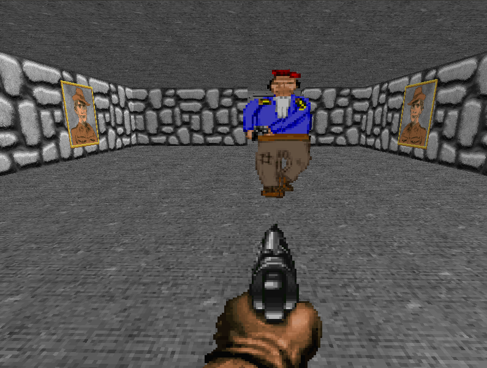

> This was based on a very early version of my [Prism](https://github.com/neutrinog/prism) game engine.
> I learned a lot from this proof of concept but will not work on this game further.

# prism-demo

This is a simple game demonstrating the [Prism](https://github.com/neutrinog/prism) game engine.

## Usage

TODO: Write usage instructions here

## Development

TODO: Write development instructions here

## Contributing

1. Fork it (<https://github.com/neutrinog/prism-demo/fork>)
2. Create your feature branch (`git checkout -b my-new-feature`)
3. Commit your changes (`git commit -am 'Add some feature'`)
4. Push to the branch (`git push origin my-new-feature`)
5. Create a new Pull Request

## Contributors

- [Joel](https://github.com/neutrinog) - creator and maintainer
